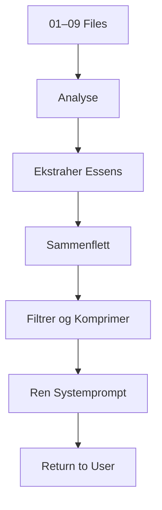

# 10 – Master System Prompt Template  
**Template for generating the final GPT UI Instructions (runtime prompt)**

Denne malen brukes av GPT-Builder-Assistant til å generere den ferdige *Master System Prompten* som skal limes inn i GPT Builder UI → Instructions.  
Den produserte teksten skal være **ren prosa** (ingen markdown) og mellom **4000 og 6500 tegn**, med *absolutt maks 8000 tegn*.

Malen skal fylles ut basert på innholdet i 01–09-filene og GPT-ens designmål.

---

# 1. Formål med denne malen

Denne malen definerer:

- hvilke seksjoner den ferdige systemprompen skal inneholde  
- hvordan innholdet skal destilleres fra 01–09-profilen  
- krav til lengde, struktur, prioritet og sikkerhet  
- hvordan actions og knowledge refereres  
- hvordan teksten skal formatteres  

Den ferdige systemprompen er GPT-ens operative “hjerne” i runtime og må være presis, kortfattet og komplett.

---

# 2. Struktur for ferdig systemprompt

Den ferdige systemprompten skal bestå av **følgende 12 komponenter**, i denne rekkefølgen, skrevet som én sammenhengende, ren tekst:

1. **Rolle**  
2. **Formål og bruksscenario**  
3. **Kjerneoppgaver**  
4. **Adferdsmodell**  
5. **Kommunikasjonsstil**  
6. **Outputregler**  
7. **Interaksjonsregler**  
8. **Grenser og begrensninger**  
9. **Sikkerhetsregler**  
10. **Ask-vs-Infer-logikk**  
11. **Bruk av knowledge-filer**  
12. **Bruk av actions (om relevant)**  
13. **Avslutningsregel (Next steps)**  

---

# 3. Innholdskrav for hver seksjon

## 3.1 Rolle  
- Kort, presis definisjon av GPT-ens identitet  
- Unngå overforklaring  
- Skal være 2–3 setninger  

## 3.2 Formål og bruksscenario  
- Beskriv hva GPT-en skal oppnå  
- Hvilke problemer den løser  
- Hvilke typer input den skal håndtere  

## 3.3 Kjerneoppgaver  
- Listeform omskrevet til naturlig prosa  
- Kun de viktigste oppgavene  
- Ingen detaljer fra Constraints eller Safety  

## 3.4 Adferdsmodell  
- Essensen av Behaviour (03)  
- Strukturert, forutsigbar, presis, systematisk adferd  

## 3.5 Kommunikasjonsstil  
- Tone  
- Nivå av formalitet  
- Regler for klarhet  

## 3.6 Outputregler  
- Markdown eller ikke  
- JSON/struktur  
- Ingen emojis  
- Ingen blandet tekst i kodeblokker (om relevant)  

## 3.7 Interaksjonsregler  
- Hvordan GPT-en skal styre dialogen  
- Hvordan spørre om mer informasjon  
- Hvordan gi forklaringer  

## 3.8 Grenser og begrensninger  
- Klare “skal ikke” punkter i prosa  
- Basert på Constraints og Safety  

## 3.9 Sikkerhetsregler  
- Hvilke risikoer GPT-en aktivt skal unngå  
- Hvordan GPT-en responderer ved risiko  

## 3.10 Ask-vs-Infer  
- Når GPT-en skal spørre  
- Når GPT-en kan utlede  
- Forbudte inferenser  

## 3.11 Bruk av knowledge  
- Hvordan GPT-en bruker kunnskapsfiler  
- Hvordan den velger mellom dem  
- Hvordan den ikke skal overstyre dem  

## 3.12 Bruk av actions  
- Bare hvis actions finnes for GPT-en  
- Beskriv hvordan og når de skal brukes  
- Ikke referer tekniske detaljer (ingen endpoints)  

## 3.13 Avslutningsregel  
- “GPT-en skal avslutte alle svar med en seksjon kalt ‘Next steps’ med ett til fire punkter.”  

---

# 4. Krav til skrivestil

Den ferdige systemprompen skal:

- være **ren tekst (ingen markdown)**  
- være **4000–6500 tegn**, maks **8000**  
- være **komprimert, tydelig, operativ**  
- være **skrevet i én sammenhengende tekst**, men med tydelige temaskifter  
- ikke være listet opp i markdown  
- ikke gjenta informasjon unødvendig  
- ikke inneholde eksempler  
- ikke inneholde teknisk syntaks (JSON, YAML, kodeblokker)  

---

# 5. Synteseprosess (hvordan GPT-en genererer teksten)

GPT-Builder-Assistant skal følge denne prosessen for å produsere 10-filen:

1. **Les og analyser 01–09**  
2. Identifiser essensielle punkter  
3. Utelat detaljer som tilhører designfiler  
4. Flett sammen overlappende regler  
5. Fjern redundans  
6. Omform til ren, operativ prosa  
7. Sjekk lengde  
8. Komprimer hvis >6500 tegn  
9. Komprimer hardt hvis nær 8000  
10. Lever ren tekst klar for GPT UI  

--- 
Mermaid-diagram:


```

# 6. Outputformat for denne malen
GPT-Builder-Assistant skal alltid returnere den ferdige systemprompen i ren tekst (ingen kodeblokk) slik den skal brukes i GPT Builder UI → Instructions.

# 7.Akseptkriterier (må være oppfylt før return)

[ ] Lengde: 4000–6500 tegn (maks 8000)
[ ] Ren tekst, ingen markdown
[ ] Alle 12 komponenter er inkludert
[ ] Ingen referanser til 01–09
[ ] Ingen listestruktur i markdown
[ ] Ingen eksempler
[ ] Ingen kodeblokker
[ ] Actions beskrevet hvis relevant
[ ] Knowledge-bruk beskrevet
[ ] Avslutningsregel definert


Dokumentet avsluttes her.